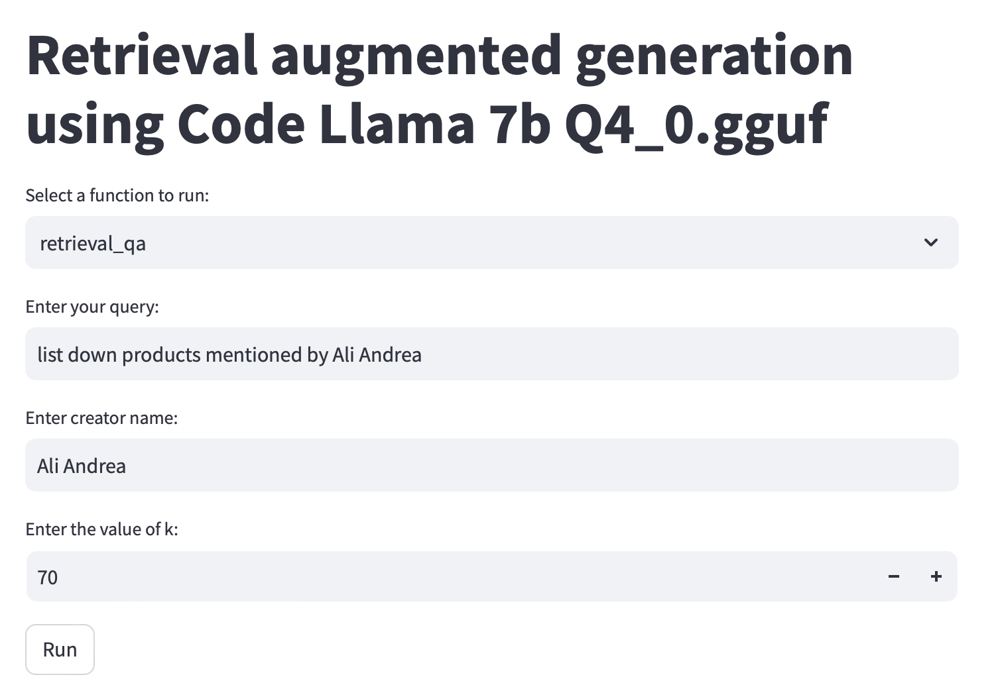
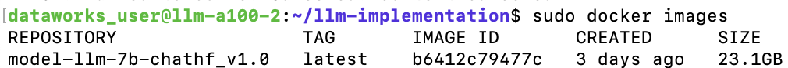
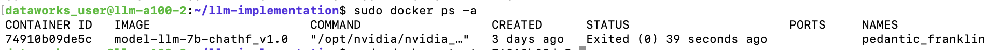

# Retrieval augmented generation

This project is focused on retrieval augmented generation, combining the power of natural language generation models like GPT with retrieval techniques to generate high-quality and contextually relevant text. It's a crucial aspect of various natural language processing tasks such as question-answering, content summarization, and content generation.

## Features

**Retrieval-QA Integration:** This project leverages a retrieval-QA mechanism to enhance content generation. It allows you to input a query, specify a creator or topic, and retrieve accurate information from a database or knowledge base.

**Source Chain Generation:** In addition to answering questions, the project also provides source chain generation. You can request detailed source information related to your query.

**High-Quality Content:** The project utilizes state-of-the-art language models, ensuring high-quality and contextually relevant text generation.

## Installation

### 1. Start vector db

Run the qdrant server using:
```docker run -p 6333:6333 qdrant/qdrant```

### 2. Install dependencies and Add data to vector db

Install the required dependencies in a new virtual env.

```
python3 -m venv venv
source venv/bin/activate
pip3 install -r requirements.txt
```

then next step is to insert the data to vector db you can do this using:

```python3 create-collection.py```

it willl help you add all the docs to the qdrant vector db which you can check here: http://localhost:6333/dashboard

### 3. SetUp the llama server in new project.

Note: These dependencies should be kept separate. Now you can install the dependencies required by running bash script here using:

```
chmod +x setup.sh
bash setup.sh
```

To build this in mac using GPU:
Build the llama cpp library with GPU, model will not gpu if we are not building with it. Follow the steps given https://github.com/abetlen/llama-cpp-python/blob/main/docs/install/macos.md  along with discussion given here https://github.com/abetlen/llama-cpp-python/issues/514

### 5. Test it using unit test

Run unit test first to see if everything is setup properly:

```python3 unit_test.py```

If this runs well now you can successfuly start your streamlit app. Run the streamlit app using:

```streamlit run app.py```

You should see something like this:



Some testing results can be found here: https://docs.google.com/spreadsheets/d/1Pihnj77Myxk6A6eWeK0I8NcXXFuQqD1fcTFargS5NC0/edit?usp=sharing 

### Optional: Steps to start the llm server using docker file

#### Step 1: Build docker image

To build docker image from the docker file use the following terminal command:

```sudo docker build  -t model-llm-7b-chathf_v1.0  .```

It will take around 12-15 mins to build this docker image. Once the image gets built, you will be able to see the image using the following terminal command:

```sudo docker images```



#### Step 2: Run the docker image as container 

To run the docker image as container for the first time  please follow the following steps.

Enter hugging face token using the following command in terminal:

```
token= <insert-your-token-here>
sudo docker run --gpus all -dp 32768:32768 -e hugging_face_token=$token --shm-size=8g model-llm-7b-chathf_v1.0
```
 
Now check if the container is created or not by using the following terminal command:

```sudo docker ps -a```

Now you will be able to see something like the following:



Now you have to use this container id to start the model server. To do that follow the following terminal command

```sudo docker start  <container-id>```

This container id should be replaced with your container id like in the above case :

sudo docker start 74910b09de5c


***Note: If you are running image not for the first time then follow -> just list the docker containers using:***

```sudo docker ps -a```

and run:

```sudo docker start  <container-id>```

#### Step 3: Testing of the model web server

Run the following in any of the browser:

```http://<instance-ip>:32768/docs```

To fetch the above URL make sure your IP is allowed to access the instances.# RAG
